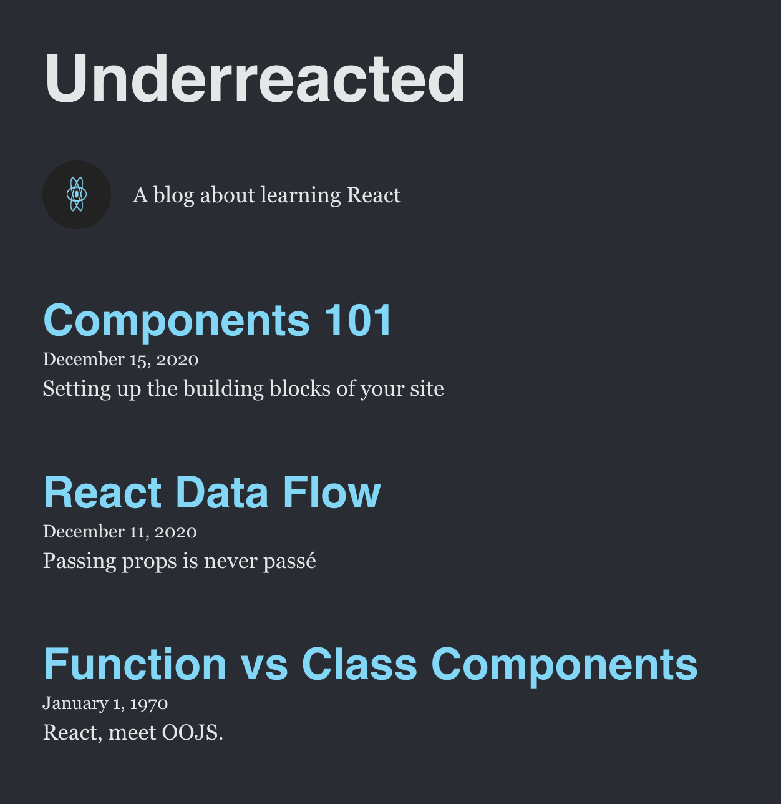

# Underreacted Blog Lab
This project is a simple static blog site built with React and Vite.

## Table of Contents

- [Demo](#demo)  
- [Setup](#setup)  
- [Testing](#testing)  
- [Usage](#usage)
---

## Demo

## Setup
1. Clone the repo
2. `npm install`
3. `npm run dev` 
4. Follow link to view site

## Testing
- Run `npm test` to execute the Jest suite.

## Usage
- Header: Displays the blog name.

- About: Shows logo and description.

- ArticleList: Renders a list of ** components.

- Article: Displays individual post details.